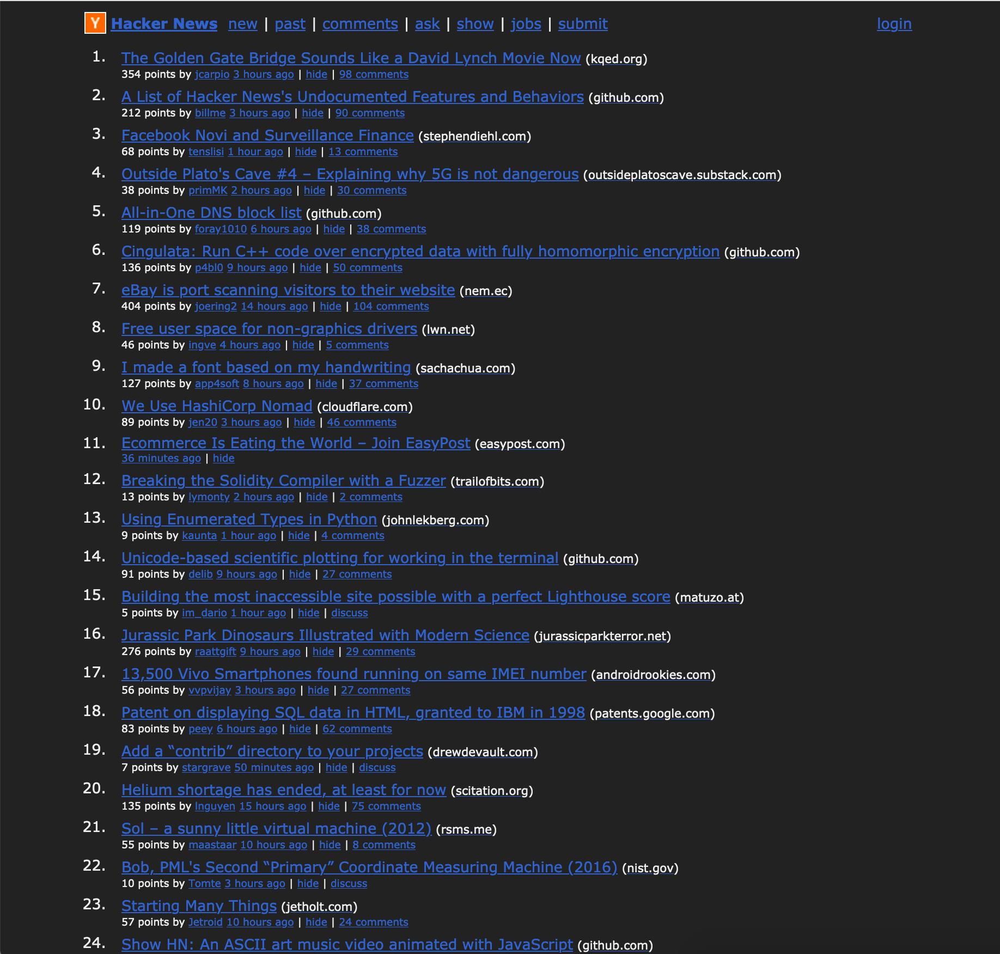
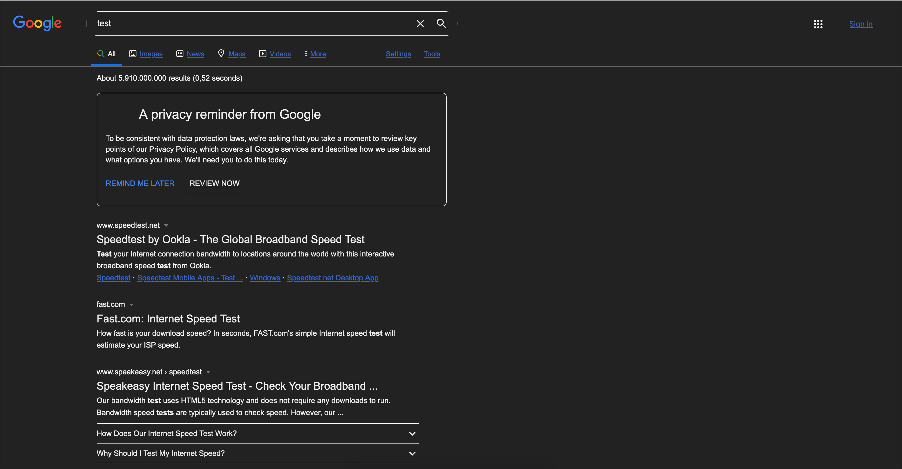

# 222. Dark mode. Everywhere.

222 is a bookmarklet that enables darkmode on any website.

Simply drag and drop these 222 bytes to your bookmarks bar
```javascript
javascript:document.querySelectorAll('*').forEach(e=>e.setAttribute('style','background-color:#222;background-image:none;color:#'+(/^A|BU/.test(e.tagName)?'36c;text-decoration:underline;':'eee;')+e.getAttribute('style')))
```
And then click the bookmark on any page you want to enable darkmode on.

```javascript
javascript:document.querySelectorAll('*').forEach(e=>e.setAttribute('style','background-color:#222;background-image:none;color:#'+(/^A|BU/.test(e.tagName)?'36c;text-decoration:underline;':'eee;')+e.getAttribute('style')))
```

## Examples




## Alternative Installation
Simply create a bookmark and set the content of [./index.js](./index.js) as the url and click it on any page you want to enable dark mode.

## Customization
Customizing is easy, simpy fork the project and change the styles you would like in [./index.js](./index.js).

## Contributing
Please open pull requests and issues on github for anything you find :).
